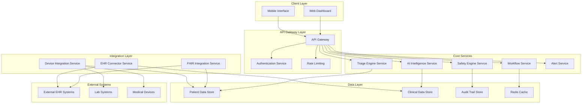

# Design Document: MedAssist Clinical Enhancements

## Overview

This design document outlines the architecture and implementation approach for enhancing the MedAssist AI clinical decision-support system. The enhancements focus on six key areas: clinical workflow integration, advanced AI intelligence, safety and compliance, user experience improvements, data interoperability, and performance scalability.

The system maintains its core mission as an assistive clinical tool that reduces physician administrative burden while ensuring all outputs include appropriate medical disclaimers and remain subject to physician review. The enhanced architecture adopts a microservices pattern to support scalability, maintainability, and regulatory compliance.

## Architecture

### High-Level Architecture

The enhanced MedAssist system follows a microservices architecture pattern with the following core components:



### Service Architecture Patterns

**Microservices Design Principles:**
- Each service owns its data and business logic
- Services communicate via well-defined APIs
- Independent deployment and scaling capabilities
- Fault isolation and resilience patterns
- Event-driven architecture for real-time updates

**API Design:**
- RESTful APIs with OpenAPI 3.0 specifications
- GraphQL for complex data queries
- WebSocket connections for real-time updates
- FHIR R4 compliance for healthcare data exchange

## Components and Interfaces

### 1. Enhanced Clinical Dashboard

**Frontend Architecture:**
- React 19.2.0 with TypeScript for type safety
- Responsive design using CSS Grid and Flexbox
- Progressive Web App (PWA) capabilities for mobile access
- WebSocket integration for real-time updates
- Keyboard shortcuts for efficient clinical workflows

**Key Features:**
- Multi-patient monitoring dashboard with real-time status indicators
- Customizable layouts for different medical specialties
- Accessibility compliance (WCAG 2.1 AA)
- Offline capability with data synchronization

**Interface Components:**
```typescript
interface PatientDashboard {
  patientId: string;
  vitals: RealTimeVitals;
  alerts: ClinicalAlert[];
  riskScores: RiskAssessment;
  priorityLevel: TriagePriority;
  lastUpdated: timestamp;
}

interface ClinicalAlert {
  alertId: string;
  severity: 'CRITICAL' | 'HIGH' | 'MEDIUM' | 'LOW';
  category: AlertCategory;
  message: string;
  timestamp: timestamp;
  acknowledged: boolean;
  source: string;
}
```

### 2. Triage Engine Service

**Core Functionality:**
- Real-time patient priority scoring using ML models
- Multi-dimensional risk assessment (cardiac, respiratory, infection, medication)
- Queue management with automatic prioritization
- Configurable alert thresholds per specialty

**Algorithm Design:**
- Ensemble ML models combining multiple risk factors
- Continuous learning from clinical outcomes
- Explainable AI for transparency in scoring decisions
- Integration with clinical guidelines and protocols

**Data Models:**
```typescript
interface TriageScore {
  patientId: string;
  overallScore: number; // 0-100
  riskCategories: {
    cardiac: RiskScore;
    respiratory: RiskScore;
    infection: RiskScore;
    medication: RiskScore;
  };
  priorityLevel: 'CRITICAL' | 'HIGH' | 'NORMAL';
  confidence: number;
  explanation: string[];
  lastCalculated: timestamp;
}
```

### 3. AI Intelligence Service

**Natural Language Processing:**
- Medical text summarization using transformer models
- Clinical entity extraction and normalization
- Medical terminology standardization (SNOMED CT, ICD-10)
- Context-aware clinical documentation generation

**Predictive Analytics:**
- Patient deterioration prediction models
- Risk stratification algorithms
- Population health analytics
- Trend analysis and anomaly detection

**Clinical Guidelines Integration:**
- Evidence-based recommendation engine
- Clinical pathway suggestions
- Drug interaction checking
- Contraindication alerts

**Service Interface:**
```typescript
interface AIIntelligenceService {
  summarizeReport(reportText: string): Promise<ClinicalSummary>;
  predictDeterioration(patientData: PatientData): Promise<DeteriorationRisk>;
  generateDocumentation(encounterData: EncounterData): Promise<ClinicalNote>;
  checkGuidelines(clinicalScenario: ClinicalScenario): Promise<GuidelineRecommendation[]>;
}
```

### 4. Safety Engine Service

**Safety Monitoring:**
- Real-time drug interaction checking
- Clinical decision audit trails
- Error prevention algorithms
- Safety alert management

**Compliance Framework:**
- HIPAA compliance monitoring
- FDA regulatory requirement validation
- Clinical governance workflows
- Risk management protocols

**Audit Trail System:**
```typescript
interface AuditEntry {
  auditId: string;
  userId: string;
  patientId: string;
  action: ClinicalAction;
  systemRecommendation: string;
  physicianDecision: string;
  timestamp: timestamp;
  riskLevel: string;
  complianceFlags: string[];
}
```

### 5. Integration Layer Services

**FHIR Integration Service:**
- HL7 FHIR R4 compliance
- Resource mapping and transformation
- Real-time data synchronization
- Multi-EHR system support

**EHR Connector Service:**
- Legacy system integration
- Data format transformation
- Batch and real-time processing
- Error handling and retry mechanisms

**Device Integration Service:**
- Medical device data streaming
- Real-time vital signs processing
- Lab result integration
- IoT device connectivity

**FHIR Resource Mapping:**
```typescript
interface FHIRPatientResource {
  resourceType: 'Patient';
  id: string;
  identifier: Identifier[];
  name: HumanName[];
  telecom: ContactPoint[];
  gender: 'male' | 'female' | 'other' | 'unknown';
  birthDate: string;
  address: Address[];
}

interface FHIRObservationResource {
  resourceType: 'Observation';
  id: string;
  status: ObservationStatus;
  category: CodeableConcept[];
  code: CodeableConcept;
  subject: Reference;
  valueQuantity: Quantity;
  effectiveDateTime: string;
}
```

## Data Models

### Core Data Structures

**Patient Data Model:**
```typescript
interface Patient {
  patientId: string;
  demographics: PatientDemographics;
  medicalHistory: MedicalHistory;
  currentMedications: Medication[];
  allergies: Allergy[];
  vitals: VitalSigns[];
  labResults: LabResult[];
  riskFactors: RiskFactor[];
  careTeam: CareTeamMember[];
}

interface PatientDemographics {
  firstName: string;
  lastName: string;
  dateOfBirth: Date;
  gender: Gender;
  contactInfo: ContactInformation;
  emergencyContact: EmergencyContact;
  insurance: InsuranceInformation;
}
```

**Clinical Data Model:**
```typescript
interface ClinicalEncounter {
  encounterId: string;
  patientId: string;
  encounterType: EncounterType;
  startTime: timestamp;
  endTime?: timestamp;
  provider: HealthcareProvider;
  chiefComplaint: string;
  assessmentAndPlan: AssessmentPlan[];
  clinicalNotes: ClinicalNote[];
  orders: ClinicalOrder[];
  status: EncounterStatus;
}

interface ClinicalNote {
  noteId: string;
  noteType: NoteType;
  content: string;
  author: HealthcareProvider;
  timestamp: timestamp;
  aiGenerated: boolean;
  reviewedBy?: HealthcareProvider;
  disclaimer: string; // "For physician review only"
}
```

**Risk Assessment Model:**
```typescript
interface RiskAssessment {
  assessmentId: string;
  patientId: string;
  riskCategories: {
    cardiac: {
      score: number;
      factors: RiskFactor[];
      recommendations: string[];
    };
    respiratory: {
      score: number;
      factors: RiskFactor[];
      recommendations: string[];
    };
    infection: {
      score: number;
      factors: RiskFactor[];
      recommendations: string[];
    };
    medication: {
      score: number;
      interactions: DrugInteraction[];
      contraindications: string[];
    };
  };
  overallRisk: number;
  confidence: number;
  lastUpdated: timestamp;
  modelVersion: string;
}
```

### Data Storage Strategy

**Multi-Database Architecture:**
- **PostgreSQL**: Structured clinical data, patient records, audit trails
- **MongoDB**: Unstructured clinical notes, AI-generated content, document storage
- **Redis**: Real-time caching, session management, temporary data
- **InfluxDB**: Time-series data for vitals, lab trends, monitoring data

**Data Partitioning:**
- Patient data partitioned by healthcare organization
- Time-series data partitioned by date ranges
- Audit data with long-term retention policies
- Cached data with TTL-based expiration

## Correctness Properties

*A property is a characteristic or behavior that should hold true across all valid executions of a system—essentially, a formal statement about what the system should do. Properties serve as the bridge between human-readable specifications and machine-verifiable correctness guarantees.*

Based on the prework analysis of acceptance criteria, the following properties ensure system correctness:

### Property 1: Real-time Alert Response
*For any* patient vital sign change that exceeds configured thresholds, the Alert_System should generate notifications within 30 seconds and update risk stratification in real-time
**Validates: Requirements 1.1, 8.2**

### Property 2: Triage Priority Ordering
*For any* collection of patients requiring attention, the Triage_Engine should order them by clinical urgency scores in descending priority order
**Validates: Requirements 1.2**

### Property 3: Workflow Automation Suggestions
*For any* clinical scenario where routine tasks are identified, the MedAssist_System should provide appropriate workflow automation suggestions
**Validates: Requirements 1.3**

### Property 4: Dashboard Completeness
*For any* Licensed_Physician accessing the Clinical_Dashboard, the system should display all required elements: multi-patient overview, status indicators, and real-time data
**Validates: Requirements 1.4**

### Property 5: Configuration Persistence
*For any* configuration changes made by Licensed_Physicians (alert thresholds, priority rules, specialty layouts), the system should persist and apply these settings consistently
**Validates: Requirements 1.5, 4.3**

### Property 6: AI Processing Accuracy
*For any* medical report or clinical text processed by the AI_Intelligence_Module, the extracted key findings should maintain 95% accuracy compared to manual review and include proper medical coding
**Validates: Requirements 2.1, 7.2**

### Property 7: Predictive Alert Timing
*For any* patient data indicating deterioration risk, the AI_Intelligence_Module should generate alerts within the 2-6 hour prediction window before critical events
**Validates: Requirements 2.2**

### Property 8: Evidence-Based Recommendations
*For any* clinical decision support provided, the system should include evidence-based guideline recommendations with proper source citations
**Validates: Requirements 2.3**

### Property 9: AI Documentation Generation
*For any* clinical encounter requiring documentation, the AI_Intelligence_Module should generate structured drafts containing all required elements and maintain chronological patient history
**Validates: Requirements 2.4, 7.3**

### Property 10: Clinical Context Preservation
*For any* patient with multiple encounters, the AI_Intelligence_Module should maintain clinical context and patient history across all care episodes
**Validates: Requirements 2.5, 7.5**

### Property 11: Drug Interaction Detection
*For any* medication combination with known interactions, the Safety_Engine should generate alerts with appropriate severity levels and clinical recommendations
**Validates: Requirements 3.1**

### Property 12: Audit Trail Completeness
*For any* clinical decision support action, the Audit_Trail should record complete information including system inputs, outputs, and physician actions
**Validates: Requirements 3.2**

### Property 13: Regulatory Compliance Validation
*For any* system operation, compliance checks should validate HIPAA and FDA requirements are met, and accessibility standards (WCAG 2.1 AA) are maintained
**Validates: Requirements 3.3, 4.4**

### Property 14: Safety Error Prevention
*For any* potentially unsafe clinical action identified, the Safety_Engine should prevent the action and require Licensed_Physician confirmation
**Validates: Requirements 3.4**

### Property 15: Medical Disclaimer Inclusion
*For any* clinical output generated by the system, it should include the disclaimer "For physician review only"
**Validates: Requirements 3.5**

### Property 16: Responsive Design Functionality
*For any* device type (mobile, tablet, desktop), the Clinical_Dashboard should maintain full functionality with appropriate responsive design
**Validates: Requirements 4.1**

### Property 17: User Interface Responsiveness
*For any* user interaction with the Clinical_Dashboard, the system should provide immediate visual feedback
**Validates: Requirements 4.4**

### Property 18: Keyboard Navigation Efficiency
*For any* common clinical task, the Clinical_Dashboard should provide efficient keyboard shortcuts for rapid access
**Validates: Requirements 4.5**

### Property 19: FHIR Message Processing
*For any* HL7 FHIR-compliant message received from EHR systems, the Integration_Layer should successfully process and integrate the data
**Validates: Requirements 5.1**

### Property 20: Lab Result Processing Timing
*For any* lab result becoming available, the MedAssist_System should import and analyze it within 5 minutes
**Validates: Requirements 5.2**

### Property 21: Real-time Device Data Processing
*For any* medical device streaming vital signs or measurements, the Integration_Layer should process the data in real-time
**Validates: Requirements 5.3**

### Property 22: Data Integrity and Isolation
*For any* data synchronization operation, the system should maintain data integrity, prevent duplication, and ensure multi-tenant data isolation
**Validates: Requirements 5.4, 6.1**

### Property 23: Multi-EHR Concurrent Processing
*For any* scenario with multiple EHR systems, the Integration_Layer should support concurrent connections and proper data mapping
**Validates: Requirements 5.5**

### Property 24: System Performance Response
*For any* clinical data query, the system should respond within 2 seconds for 95% of requests, with intelligent caching improving frequently accessed data response times
**Validates: Requirements 6.2, 6.4**

### Property 25: Auto-scaling Behavior
*For any* increase in system load, the MedAssist_System should automatically scale resources to maintain performance
**Validates: Requirements 6.3**

### Property 26: Clinical Note Generation
*For any* clinical encounter with data inputs, the AI_Intelligence_Module should generate structured clinical notes
**Validates: Requirements 7.1**

### Property 27: Specialty Template Availability
*For any* medical specialty and common clinical scenario, the system should provide appropriate documentation templates
**Validates: Requirements 7.4**

### Property 28: Multi-dimensional Risk Calculation
*For any* patient data analyzed, the AI_Intelligence_Module should calculate all required risk dimensions: cardiac, respiratory, infection, and medication risks
**Validates: Requirements 8.1**

### Property 29: Population Health Analysis
*For any* patient cohort analyzed, the system should identify relevant trends and patterns across the population
**Validates: Requirements 8.3**

### Property 30: Risk Prediction Transparency
*For any* risk prediction generated, the system should provide confidence intervals and model explanations
**Validates: Requirements 8.4**

<function_calls>
<invoke name="prework">
<parameter name="featureName">medassist-clinical-enhancements

## Error Handling

### Error Classification and Response Strategy

**Clinical Safety Errors (Critical):**
- Drug interaction conflicts
- Vital sign threshold breaches
- Patient safety alerts
- Response: Immediate alert, require physician acknowledgment, audit trail entry

**Data Integration Errors (High):**
- FHIR message parsing failures
- EHR connectivity issues
- Device data stream interruptions
- Response: Retry with exponential backoff, fallback to cached data, notify administrators

**AI Processing Errors (Medium):**
- NLP processing failures
- Risk calculation errors
- Prediction model failures
- Response: Fallback to rule-based systems, flag for manual review, log for model improvement

**System Performance Errors (Low):**
- Cache misses
- Slow query responses
- Scaling delays
- Response: Graceful degradation, performance monitoring, automatic recovery

### Error Recovery Patterns

**Circuit Breaker Pattern:**
```typescript
interface CircuitBreaker {
  state: 'CLOSED' | 'OPEN' | 'HALF_OPEN';
  failureCount: number;
  failureThreshold: number;
  timeout: number;
  execute<T>(operation: () => Promise<T>): Promise<T>;
}
```

**Retry with Exponential Backoff:**
```typescript
interface RetryConfig {
  maxAttempts: number;
  baseDelay: number;
  maxDelay: number;
  backoffMultiplier: number;
  retryableErrors: ErrorType[];
}
```

**Graceful Degradation:**
- AI services unavailable → Fall back to rule-based clinical guidelines
- Real-time data unavailable → Use last known good values with timestamps
- External integrations down → Continue with cached data and queue updates

### Error Monitoring and Alerting

**Clinical Error Monitoring:**
- Real-time monitoring of patient safety alerts
- Automated escalation for critical clinical events
- Integration with hospital notification systems

**System Health Monitoring:**
- Application performance monitoring (APM)
- Infrastructure monitoring and alerting
- Predictive failure detection

**Compliance Error Tracking:**
- HIPAA violation detection and reporting
- FDA compliance monitoring
- Audit trail integrity verification

## Testing Strategy

### Dual Testing Approach

The MedAssist system requires both unit testing and property-based testing to ensure comprehensive coverage and clinical safety:

**Unit Testing Focus:**
- Specific clinical scenarios and edge cases
- Integration points between services
- Error conditions and safety mechanisms
- Regulatory compliance validation
- Medical device integration scenarios

**Property-Based Testing Focus:**
- Universal properties across all patient data
- AI model behavior consistency
- Data integrity and security properties
- Performance characteristics under load
- Clinical workflow correctness

### Property-Based Testing Configuration

**Testing Framework Selection:**
- **Python**: Hypothesis for AI services and data processing
- **TypeScript/JavaScript**: fast-check for frontend and API testing
- **Integration Testing**: Custom property generators for clinical data

**Test Configuration Requirements:**
- Minimum 1000 iterations per property test (due to clinical safety requirements)
- Each property test must reference its design document property
- Tag format: **Feature: medassist-clinical-enhancements, Property {number}: {property_text}**
- Clinical data generators must produce realistic medical scenarios
- All tests must include appropriate medical disclaimers

**Clinical Data Generators:**
```typescript
// Example property test structure
interface ClinicalDataGenerator {
  generatePatient(): Patient;
  generateVitalSigns(): VitalSigns;
  generateMedications(): Medication[];
  generateLabResults(): LabResult[];
  generateClinicalScenario(): ClinicalScenario;
}

// Property test example
describe('Feature: medassist-clinical-enhancements, Property 1: Real-time Alert Response', () => {
  test('vital sign threshold breaches generate timely alerts', async () => {
    await fc.assert(fc.asyncProperty(
      generateVitalSignsWithThresholdBreach(),
      async (vitalSigns) => {
        const startTime = Date.now();
        const alert = await alertSystem.processVitalSigns(vitalSigns);
        const responseTime = Date.now() - startTime;
        
        expect(alert).toBeDefined();
        expect(responseTime).toBeLessThan(30000); // 30 seconds
        expect(alert.severity).toMatch(/CRITICAL|HIGH/);
      }
    ), { numRuns: 1000 });
  });
});
```

### Integration Testing Strategy

**Clinical Workflow Testing:**
- End-to-end patient care scenarios
- Multi-service integration validation
- Real-time data flow testing
- Emergency scenario simulation

**Regulatory Compliance Testing:**
- HIPAA compliance validation
- FDA regulatory requirement testing
- Accessibility compliance (WCAG 2.1 AA)
- Clinical safety protocol verification

**Performance and Load Testing:**
- Multi-tenant load simulation
- Real-time data processing under load
- Auto-scaling behavior validation
- Database performance optimization

**Security Testing:**
- Multi-tenant data isolation verification
- Authentication and authorization testing
- Encryption and data protection validation
- Audit trail integrity testing

### Test Data Management

**Synthetic Clinical Data:**
- FHIR-compliant synthetic patient records
- Realistic medical scenarios and conditions
- De-identified clinical data patterns
- Regulatory-compliant test datasets

**Test Environment Strategy:**
- Isolated testing environments per service
- Staging environment with full integration
- Production-like performance testing environment
- Compliance testing with regulatory sandbox data

### Continuous Testing and Monitoring

**Automated Testing Pipeline:**
- Pre-commit property-based testing
- Continuous integration with clinical scenario testing
- Automated regression testing for AI models
- Performance benchmarking and monitoring

**Clinical Validation:**
- Regular validation against clinical outcomes
- AI model accuracy monitoring and retraining
- Clinical workflow effectiveness measurement
- Patient safety metric tracking

This comprehensive testing strategy ensures that the MedAssist system maintains the highest standards of clinical safety, regulatory compliance, and system reliability while supporting continuous improvement and innovation in clinical decision support.